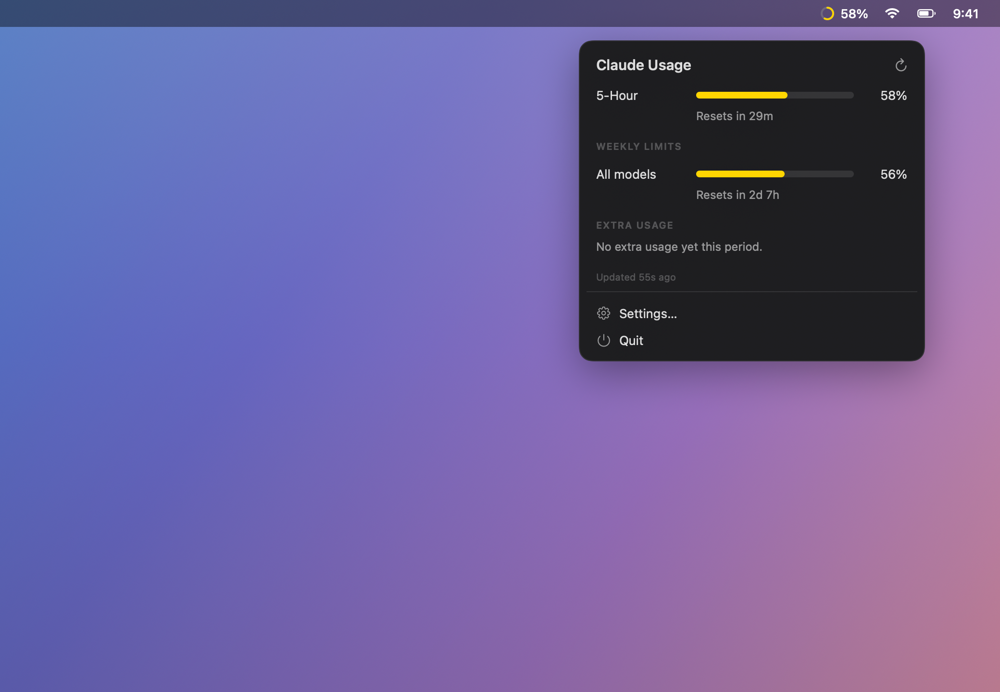

# CC Usage

**Your Claude Code limits, right in the menu bar.** See how much of your 5‑hour
session and weekly allowance you've used — and when they reset — so a "limit
reached" never catches you mid‑task.

<p align="center">
  
</p>

## What you get

- A live **usage ring + %** in the menu bar — green when you've got room, shading to red as it fills.
- A click‑away panel with your **5‑hour session**, **weekly limits**, and exact **reset countdowns**.
- **Launch at login**, one‑click **refresh**, and a built‑in **check for updates**.
- Tiny and native — about 17 MB, one process, no Electron.

The menu bar normally tracks your 5‑hour session. If your weekly allowance is the
one running low, it automatically switches to show that instead (marked `W`).

## Install

1. Download **`CC-Usage.dmg`** from the [latest release](https://github.com/max-csr/ccusage-bar/releases/latest).
2. Open it and drag **CC Usage** onto **Applications**.
3. **First launch only:** macOS will say it can't verify the developer (the app
   isn't paid‑notarized). Open **System Settings → Privacy & Security**, scroll to
   the "CC Usage was blocked" note, and click **Open Anyway**. (Or right‑click the
   app → **Open**.)
4. Launch it and click **Allow** when it asks for Keychain access — that's how it
   reads your Claude login to fetch your usage. The ring appears in your menu bar.

> **Requires:** an Apple Silicon Mac, macOS 14 or later, and Claude Code installed
> and signed in.

## Using it

- **Click the ring** for the full breakdown — both windows, their percentages, and
  live "resets in…" countdowns.
- Open **Settings…** to turn on **Launch at login** or **Check for Updates**.

## Your privacy

CC Usage talks to exactly one place: **Anthropic's own usage API**, using the login
token already on your Mac. Nothing goes anywhere else — no accounts, no analytics,
no tracking. It only ever *reads* your usage.

> The usage numbers come from an endpoint Anthropic uses internally and doesn't
> officially publish. It works today; if they change it, the numbers may briefly
> show "—" until the app is updated.

## Updates

CC Usage checks for a newer release on launch and once a day, and shows an
**"Update available"** banner when there's one (you can also check anytime from
Settings). Updating is just a quick re‑download of the dmg.

---

## Building it yourself

A small Swift app — no Xcode project needed, just the Command Line Tools.

```sh
./build-app.sh     # compile + bundle  →  CC Usage.app
./make-dmg.sh      # package           →  CC-Usage.dmg
```

Quick checks while developing:

```sh
swift build
.build/debug/ClaudeUsage --selftest       # offline sanity checks
.build/debug/ClaudeUsage --probe          # one live usage fetch, printed
.build/debug/ClaudeUsage --check-update    # compare against the latest release
```

**Cutting a release:** bump the version in `Resources/Info.plist`, run the two
scripts above, then `gh release create vX.Y.Z CC-Usage.dmg`. Installed copies
surface the update banner within a day.

**Notes**
- The app is ad‑hoc signed, not notarized — hence the one‑time Gatekeeper step
  above. A no‑warning install needs an Apple Developer ID + notarization.
- For true silent auto‑updates (instead of notify‑and‑download), the path is
  [Sparkle](https://sparkle-project.org).
- The app icon is generated by `tools/make-icon.swift` into `Resources/AppIcon.icns`.
